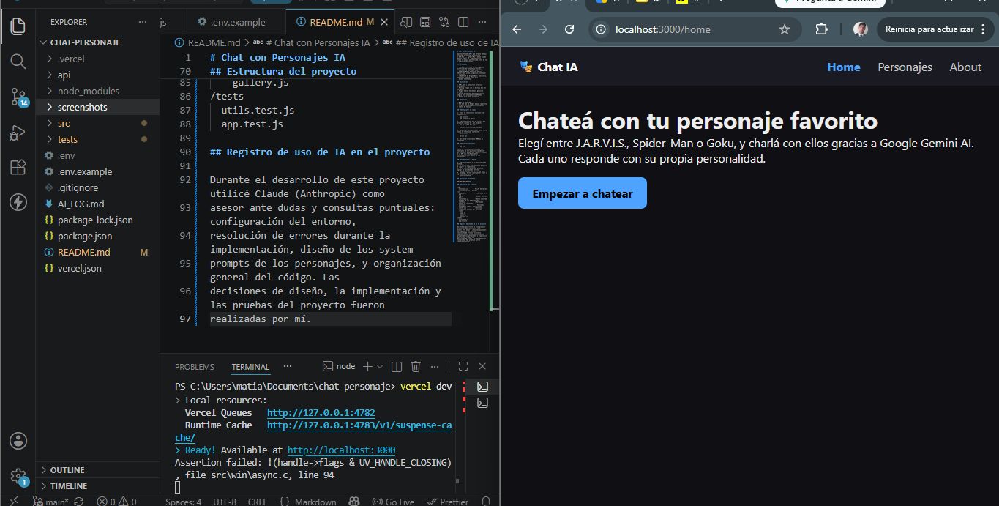
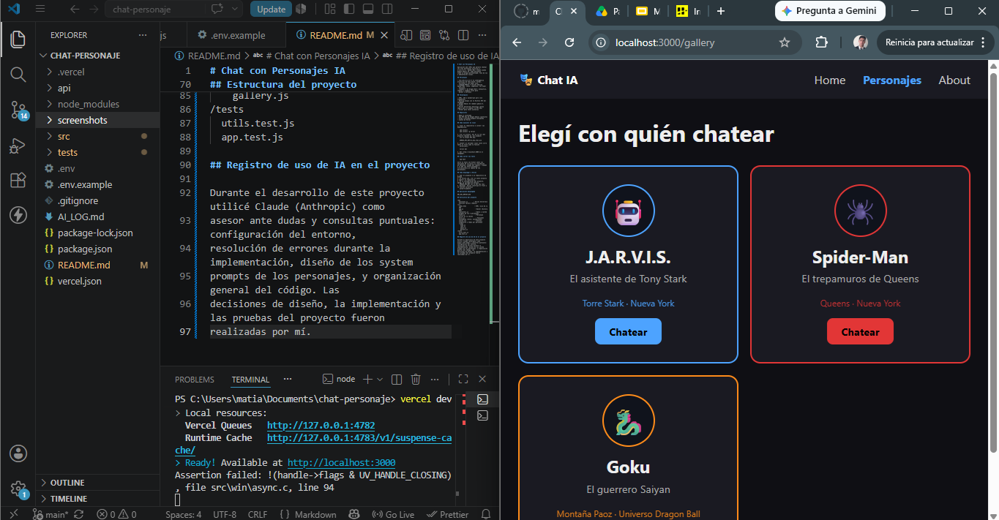
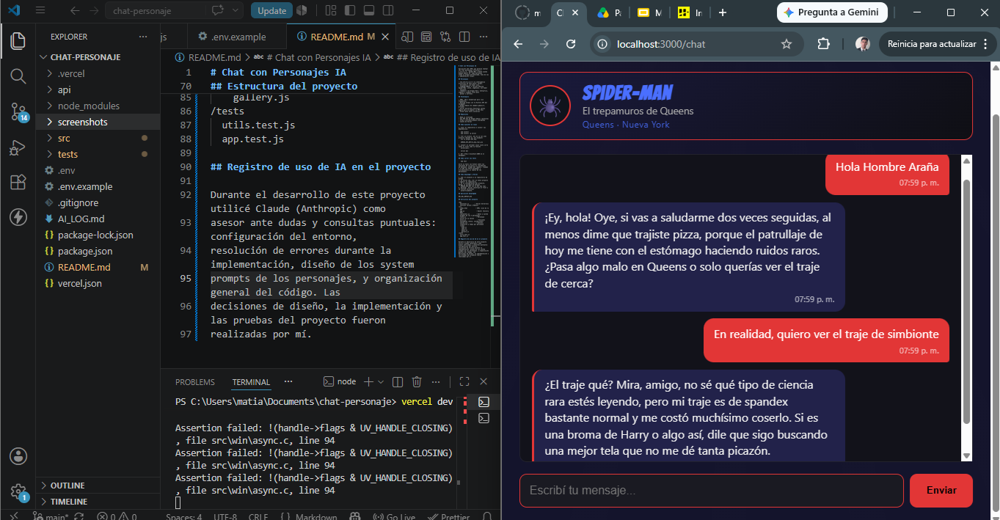
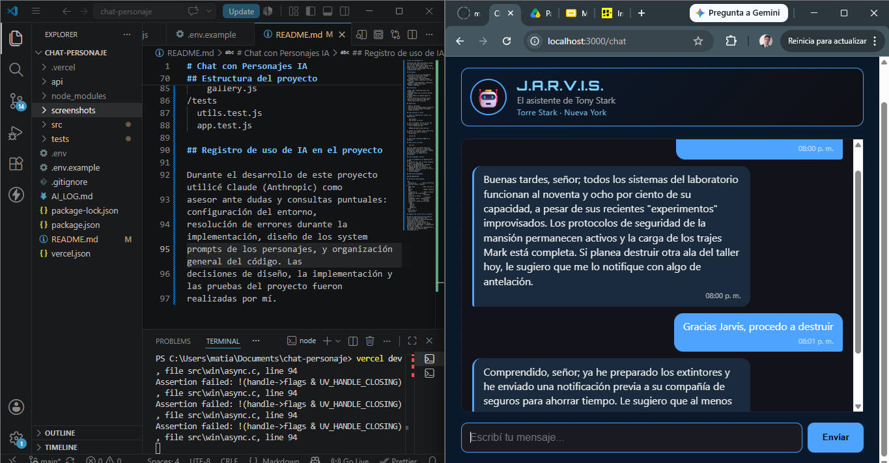
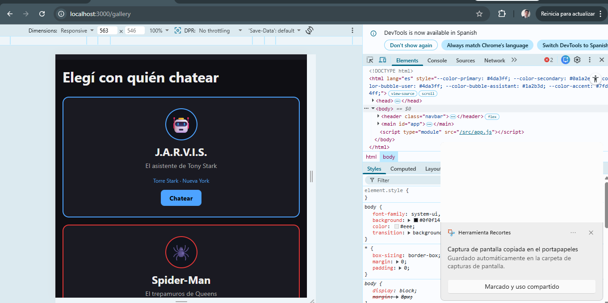

# Chat con Personajes IA

Aplicación web (SPA) que permite chatear con tres personajes ficticios —
J.A.R.V.I.S., Spider-Man y Goku— usando Google Gemini AI. Cada personaje
tiene su propia personalidad, tono de voz y ambientación visual.

## Personajes

- **J.A.R.V.I.S.** — la inteligencia artificial de Tony Stark: formal,
  eficiente y con humor seco.
- **Spider-Man** — versión Amazing Spider-Man: joven, ingenioso, con humor
  nervioso.
- **Goku** — de Dragon Ball: energético, ingenuo y siempre listo para
  pelear o entrenar.

## Tecnologías

- HTML, CSS y JavaScript puro (sin frameworks)
- Routing propio con la History API del navegador
- Google Gemini AI (modelo gemini-3.6-flash)
- Vercel Serverless Functions (proxy seguro para no exponer la API key)
- Vitest para tests unitarios

## Requisitos

- Node.js instalado
- Una API key de Google Gemini (gratuita): https://aistudio.google.com/apikey
- Cuenta de Vercel

## Cómo ejecutar en local

1. Cloná el repositorio e instalá las dependencias:

   npm install
   npm install -g vercel

2. Creá un archivo .env en la raíz del proyecto (basado en .env.example)
   con tu propia API key:

   GEMINI_API_KEY=tu_key_real_aca

3. Levantá el servidor local (esto corre tanto el front como la función
   serverless):

   vercel dev

4. Abrí http://localhost:3000 en el navegador.

## Cómo correr los tests

   npm test

Corre 11 tests con Vitest sobre las funciones de src/utils.js (validación
de mensajes, armado del request, llamado a la API con fetch mockeado) y
src/characters.js (datos de los personajes).

## Cómo desplegar a Vercel

1. Subí el proyecto a un repositorio de GitHub.
2. En vercel.com, creá un nuevo proyecto e importá el repositorio.
3. En la configuración del proyecto, agregá la variable de entorno
   GEMINI_API_KEY con tu API key real.
4. Desplegá. Vercel construye el front y la función serverless
   automáticamente.

## Capturas de pantalla

### Pantalla de inicio

### Galería de personajes

### Chat con Spider-Man

### Chat con J.A.R.V.I.S.

### Vista responsive (mobile)

URL_DEL_DEPLOY_ACA

## Estructura del proyecto

/api
  functions.js        - Vercel Serverless Function (proxy a Gemini)
/src
  index.html           - HTML único de la SPA
  app.js                - Router (History API)
  characters.js         - Datos y system prompts de los 3 personajes
  state.js              - Personaje activo en la sesión
  utils.js               - Funciones testeables (fetch, validaciones)
  styles.css            - Estilos, responsive y temas por personaje
  /views
    home.js
    chat.js
    about.js
    gallery.js
/tests
  utils.test.js
  app.test.js

## Registro de uso de IA en el proyecto

Durante el desarrollo de este proyecto utilicé Claude (Anthropic) como
asesor ante dudas y consultas puntuales: configuración del entorno,
resolución de errores durante la implementación, diseño de los system
prompts de los personajes, y organización general del código. Las
decisiones de diseño, la implementación y las pruebas del proyecto fueron
realizadas por mí.